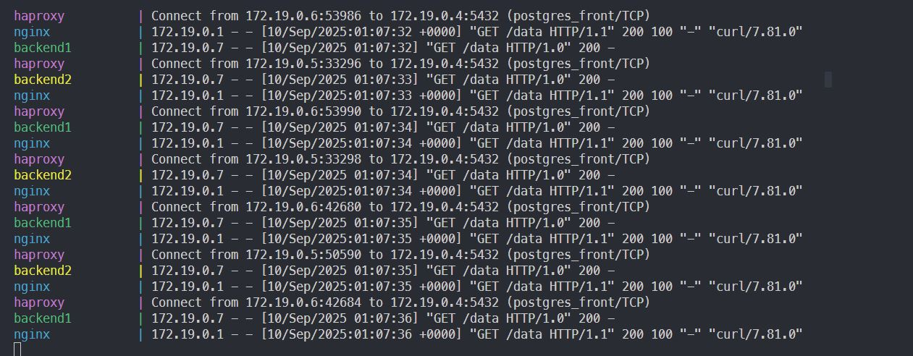
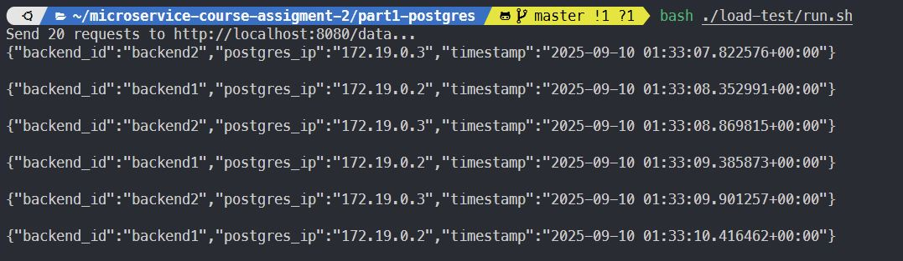
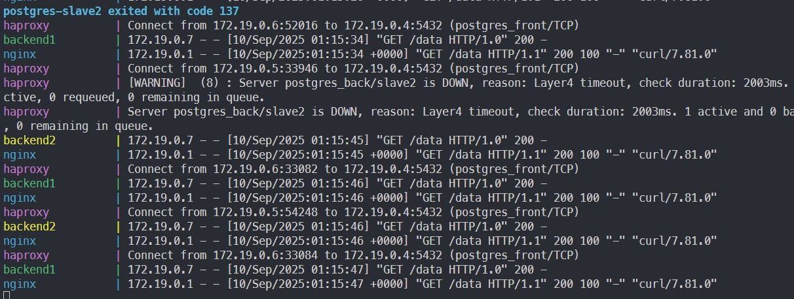
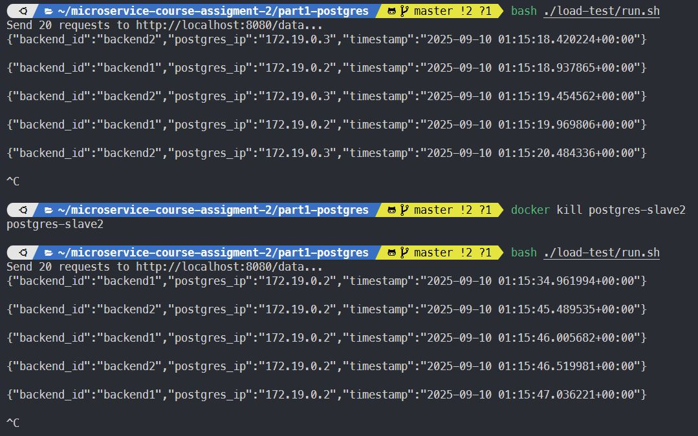
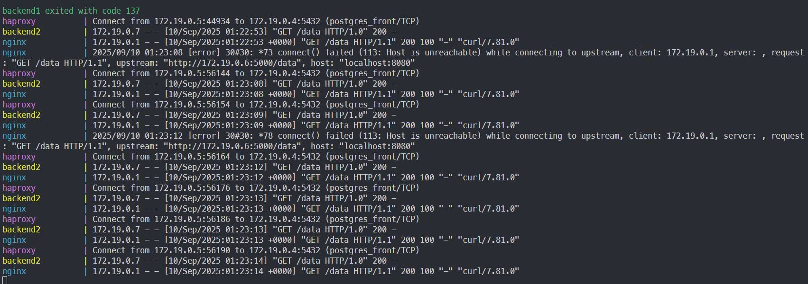
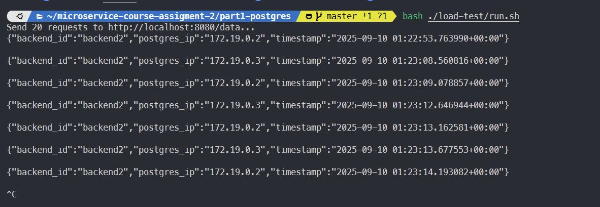

# Homework: Application fault tolerance. Part A, the extended example for Postgres

## Goal

Show resiliency on levels:

- Database (several PostgreSQL instances behind HAProxy)
- Application (several backend instances behind Nginx)

## System components

- PostgreSQL followers (2 instances without a leader)
- HAProxy (load-balancing for PostgreSQL followers)
- `backend1`, `backend2` (two instances of Python Flask-application that uses PostgreSQL)
- Nginx - balances `backend1` and `backend2` over HTTP
- `load-test/run.sh` - sends requests generating load to the application to "/data" endpoint

## How to run

```bash
$ docker-compose up -d --build
$ ./load-test/run.sh
```

## Steps

### The system running normally

1. Run the script to generate load:

```bash
$ ./load-test/run.sh
```

#### Result

You can see that requests are balanced between the two instances of the application and the two PostgreSQL instances.
`postgres_ip` is switched between the two PostgreSQL instances, so is `backend_id`. Meaning, the application is working as expected.





### А) Shutting down a PostgreSQL follower

1. Run the script to generate load:

```bash
$ ./load-test/run.sh
```

2. Imitate the failure of one follower:

```bash
$ docker kill postgres-slave2
```

3. Notice, the system continues to work through the second follower. To restore the node, you can use `docker compose restart postgres-slave1`

#### Result

You can see that PostgreSQL IP is only one of the two. Before it was two, but now it is only one.
While the application is still working.





### Б) Shutting down a backend instance

1. Run the script to generate load:

```bash
$ ./load-test/run.sh
```

2. Imitate the failure of one instance:

```bash
$ docker kill backend1
```

3. Notice, nginx continues to serve traffic to the second backend

4. Restore the instance:

```bash
$ docker-compose restart backend1
```

#### Result

You can see just one instance of the backend is serving traffic. The other instance is not available.
While PostgreSQL balancing is still in place - logs show different IPs for the PostgreSQL followers.
The application is still working.





### How to check the logs

Any of the following commands will show the logs, choose whichever fits your needs:

```bash
$ docker compose logs haproxy
$ docker compose logs nginx
$ docker compose logs -f
$ docker logs -f backend1
$ docker logs -f postgres-slave1
```

### Expected result

- All components work together, requests are balanced between the two instances of the application and the two PostgreSQL instances.
- When one of the PostgreSQL instances or the backend instance is shut down, the application remains available and functional.
